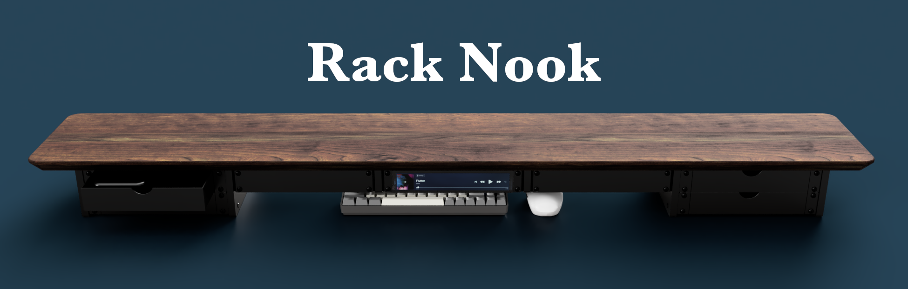
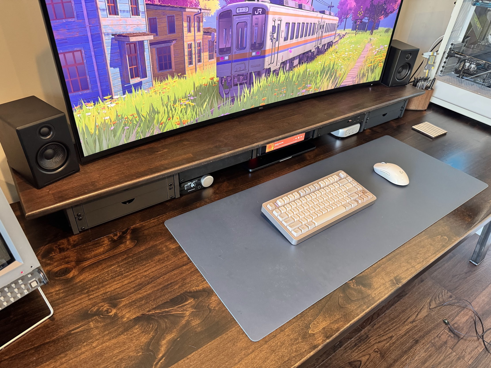

    

## Overview

Rack Nook is a modular desk shelf system, based around 10" or 19" rack components.

Steel rack rails bolt into 3D printed leg assemblies, and a shelf board sits on top. You can configure it to any width, mix and match rail sizes to create cubby areas for your keyboard or notepad, and drop in any rack accessory you like.

## Bill of Materials

You'll need the following parts to build your own *Rack Nook*, the quantity of each depends on your desired configuration:

- Wooden shelf board
- Penn Elcom Rack Rails ([1U](https://www.penn-elcom.com/us/1u-rack-rail-threaded-to-10-32-unf-r0828-01), [2U](https://www.penn-elcom.com/us/2u-rack-rail-threaded-to-10-32-unf-r0828-02), [3U](https://www.penn-elcom.com/us/3u-rack-rail-threaded-to-10-32-unf-r0828-03), etc.)
- 3D printed legs (see [`hardware/`](hardware/)) folder
- M5 (or #10) machine screws and nuts (for attaching the legs to the rails)
- M4 (or #8) wood screws (for attaching the legs to the shelf board)
- 10-32 UNF rack screws (for attaching accessories to the rails)

## Planning Your Build

### How tall?

The height of a 2U nook (including a 1" board) is 4.75", which is typical for a desk shelf. However, you can go taller if you like! You can also include shorter legs in the middle of your nook to create an open area to tuck away your keyboard, mouse, or notepad.

### Half rack, full-width, or mixed?

The spacing between each pair of legs determines which rack standard you're working with. Space them for 10" rack components, or go wider for full-size 19" components. You can even mix both in the same shelf, for example, a 19" section in the center flanked by 10" sections on each side.

### How deep?

There are two variants of legs available, one with a 200mm rail depth, and one with a 260mm rail depth. The 200mm variant is the same rail depth as the DeskPi RackMate T0 and T1 racks, and is great for shelf board depths of 9-10". The 260mm variant is the same rail depth as the DeskPi RackMate T2 rack, and is better for shelf board depths of 11-12".

### Front and back rails?

There are mounting holes for installing rack rails on both the front and back of the legs. You can however choose to install just rails on the front if you prefer, which can reduce the cost of the build.

### Custom size?

It is recommended to use one of the prebuilt sizes, but if you want to go custom, the AutoDesk Fusion parametric modelis provided in the `hardware/` folder.

## Example Configurations

### 5ft Desk Shelf (5 x 2U 10" Racks)

My setup has 5 x 10" rack sections with a 2U:1U:1U:1U:2U configuration under a 5ft x 10" butcher block shelf. This allows for a wide cubby in the middle for tucking away my keyboard and mouse, while still having a couple of 2U sections for taller rack components. I opted to install rails on the front and back of the legs.

- 6 x 3D-printed legs
  - 4 x 2U legs
  - 2 x 1U legs
- 8 x 2U rack rails
- 12 x 1U rack rails
- 24 x M5 x 25mm screws
- 24 x M5 nuts
- 24 x #8 wood screws (for attaching the legs to the shelf board)

## Assembly

Mark out the positions of the legs on the underside of the shelf board. The mounting pattern for the legs is 4" x 1 1/8".

Space the legs according to your desired rack configuration (templates coming soon). Here's a helpful diagram of 19" and 10" rack dimensions:

Drill pilot holes in the shelf board for the leg mounting holes, for example, if using #8 wood screws, drill 1/8" pilot holes. Make sure not to drill all the way through the board.

Screw the legs to the shelf board using the wood screws.

Attach the rack rails to the legs using the machine screws and nuts, two screws per leg per rail.

## What to put in it?

- [DeskPi 6.91-inch Touch Screen](https://deskpi.com/products/deskpi-6-91-inch-touch-screen-1424x280-tft-lcd-display-10-inch-1u-rackmount-monitor-for-deskpi-rackmate-t0-t1-t2-server-cabinets)
- [Various other DeskPi RackMate accessories](https://deskpi.com/collections/deskpi-rack-mate)
- [OpenRack 1U](https://makerworld.com/en/models/1032069-openrack-1u-a-modular-server-rack-system#profileId-1022189) or [OpenRack 2U](https://makerworld.com/en/models/1054148-openrack-2u-a-modular-server-rack-system#profileId-1041524) inserts
- Any other 10" or 19" rack components you like!